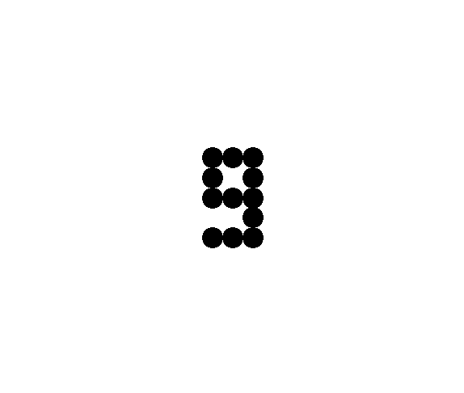
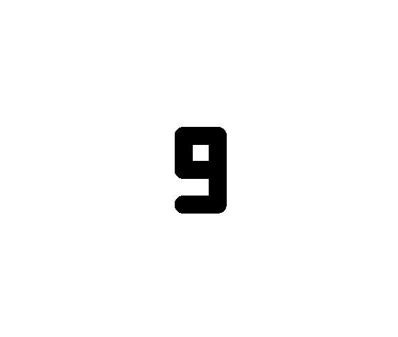
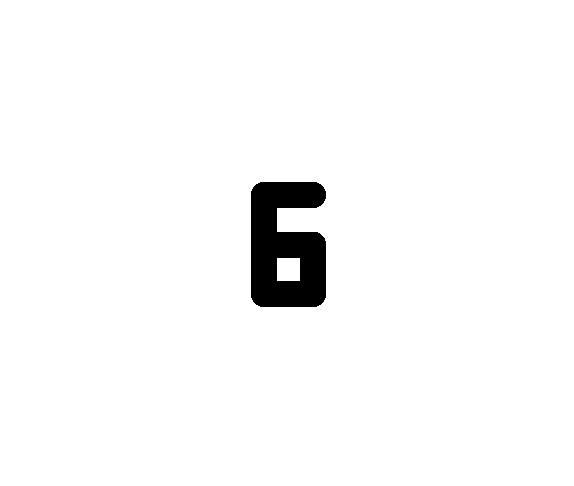
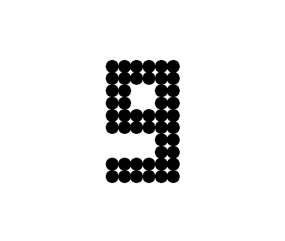

# day1

TurtleGraphics 1

## rei

|表現法 |ラスター画像                       |線ベクトル画像                     |
|:---:  |:---:                               |:---:                              |
|画像   | | |
|コード|raster-9.py              |vector-9.py|

* 「9」のラスター画像

| y\x | 0   | 1   | 2   |
|:---:|:---:|:---:|:---:|
|0    |1    |1    |1    |
|1    |1    |0    |1    |
|2    |1    |1    |1    |
|3    |0    |0    |1    |
|4    |1    |1    |1    |

* 「9」の線ベクトル画像

| xs  | ys  | xe  | ye  |
|:---:|:---:|:---:|:---:|
|2    |2    |0    |2    |
|0    |2    |0    |0    |
|0    |0    |2    |0    |
|2    |0    |2    |4    |
|2    |4    |0    |4    |

## kadai1-1

### 問題

説明で用いた「9」の絵を180度回転させると「6」になる。turtleで「6」の絵を描きなさい。ソースコードの手数はどの程度増えるか。

### 回答

|表現法 |ラスター画像                       |線ベクトル画像                     |
|:---:  |:---:                              |:---:                              |
|画像   | | |
|コード|raster-6.py              |vector-6.py|
|手数   |増えない                           |増えない                           |

## kadai1-2

### 問題

この「6」の絵をラスター画像、線ベクトル画像の表現で絵を表にあらわせ。

### 回答

* 「6」のラスター画像

| y\x | 0   | 1   | 2   |
|:---:|:---:|:---:|:---:|
|0    |1    |1    |1    |
|1    |1    |0    |0    |
|2    |1    |1    |1    |
|3    |1    |0    |1    |
|4    |1    |1    |1    |

* 「6」の線ベクトル画像

| xs  | ys  | xe  | ye  |
|:---:|:---:|:---:|:---:|
|0    |2    |2    |2    |
|2    |2    |2    |4    |
|2    |4    |0    |4    |
|0    |4    |0    |0    |
|0    |0    |2    |0    |

## kadai1-3

### 問題

説明で用いた「9」の絵を縦横2倍に拡大した絵をturtleで描きなさい。ソースコードの手数はどの程度増えるか。

### 回答

|表現法 |ラスター画像                              |線ベクトル画像                            |
|:---:  |:---:                                     |:---:                                     |
|画像   | | |
|コード|raster-9-2times.py              |vector-9-2times.py|
|手数   |増える                                    |増えない                                  |

## kadai1-4

### 問題

拡大した絵をラスター画像、線ベクトル画像の表現で表にあらわせ。

### 回答

* 拡大した「9」のラスター画像

| y\x | 0   | 1   | 2   | 0   | 1   | 2   |
|:---:|:---:|:---:|:---:|:---:|:---:|:---:|
|0    |1    |1    |1    |1    |1    |1    |
|1    |1    |1    |1    |1    |1    |1    |
|2    |1    |1    |0    |0    |1    |1    |
|3    |1    |1    |0    |0    |1    |1    |
|5    |1    |1    |1    |1    |1    |1    |
|6    |1    |1    |1    |1    |1    |1    |
|7    |0    |0    |0    |0    |1    |1    |
|8    |0    |0    |0    |0    |1    |1    |
|9    |1    |1    |1    |1    |1    |1    |
|10   |1    |1    |1    |1    |1    |1    |

* 拡大した「9」の線ベクトル画像

| xs  | ys  | xe  | ye  |
|:---:|:---:|:---:|:---:|
|4    |4    |0    |4    |
|0    |4    |0    |0    |
|0    |0    |4    |0    |
|4    |0    |4    |8    |
|4    |8    |0    |8    |

## kadai1-5

### 問題

説明で用いた「9」の絵のラスター画像表現について、縦横2倍に拡大することは、
(i,j)の1つのセルの塗りつぶしを(2i,2j),(2i+1,2j),(2i,2j+1),(2i,2j)の4つのセルの塗りつぶしに対応させることになる。
この違いから、ラスター画像とベクトル画像のそれぞれが、どのような絵の表現に向いているか考察せよ。

### 回答

* ラスター画像

  絵画、写真のように描写が複雑なデータの表示が出来る

* ベクトル画像

  文字、図形のように拡大縮小するデータに適している

