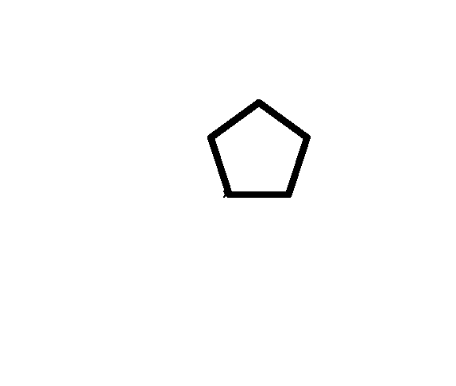
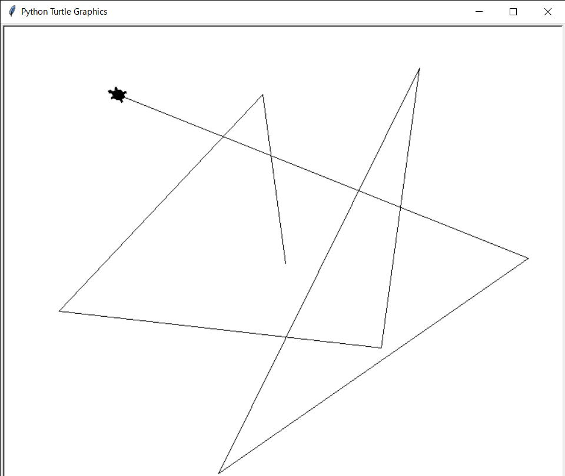

# day2

TurtleGraphics 2

## kadai2-1

### 問題

星☆を描く。

### 回答

```powershell
$ python star.py
```


## kadai2-2

### 問題

正N角形を描くメソッドを作る。

### 回答

```powershell
$ python polygon.py
```



## kadai2-3

### 問題

座標(x,y)の方向に亀を向かせるメソッドlookを作る。
+ 例に挙げたcomeメソッドは、亀の向きを変えずにマウスクリック方向に途中まで移動する。
+ 上記で作成したlookメソッドを呼び出すことにより、亀の向きを変えてマウスクリック方向に途中まで移動するよう改造せよ。
+ 作成したプログラムを動かし、何回か適当な場所でマウスクリックした場合の様子をスクリーンショットに保存せよ。


### 回答

```powershell
$ python look.py
```


