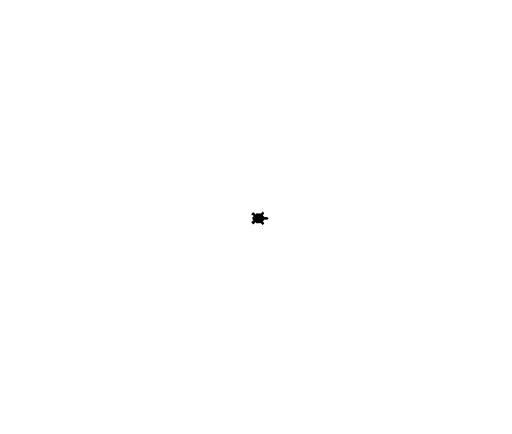

# day2

TurtleGraphics 2

## kadai2-1

### 問題

星☆を描く。

### 回答

```powershell
$ python .\kadai2-1.py
```


## kadai2-2

### 問題

正N角形を描くメソッドを作る。

### 回答

```powershell
$ python .\kadai2-2.py
```


## kadai2-3

### 問題

座標(x,y)の方向に亀を向かせるメソッドlookを作る。

### 回答

```powershell
$ python .\kadai2-3.py
```


