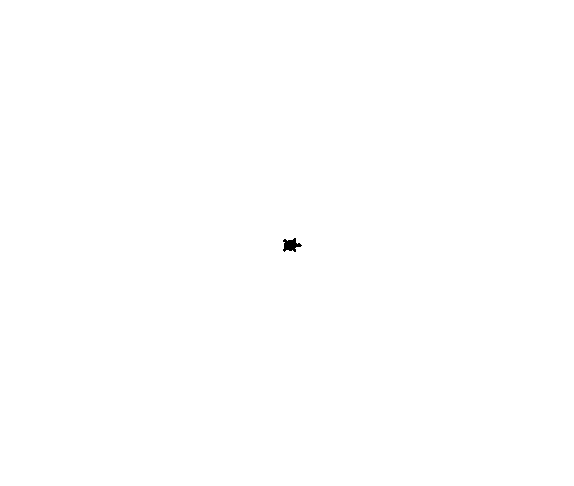
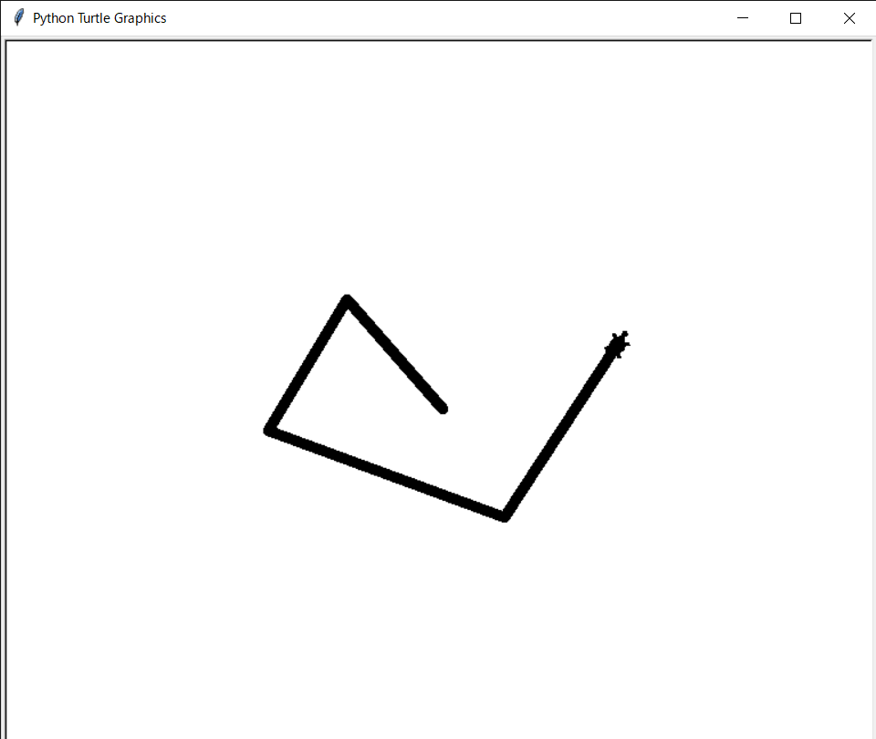

# day3

TurtleGraphics 3

## kadai3-1

### 問題

先週作成したメソッド・関数を使い、マウスクリックした方向を向かせて、
その方向にクリックした座標と亀の座標との距離を半分に縮めるよう前進させる、
というのを繰り返すプログラムを作成し、d03.py とせよ。

### 回答

```powershell
$ python d03.py.py
```

<!--

-->



