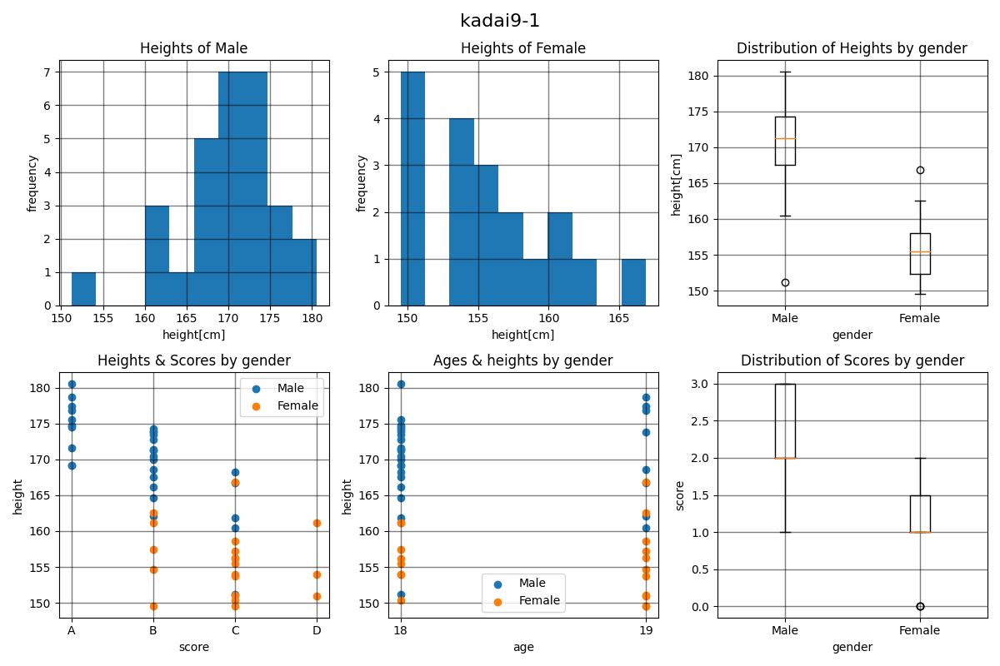

# day9

pandas、matplotlib

## kadai9-1

### 問題

+ このデータフレームについて、matplotlibを使って、正しいグラフをいくつか作りなさい。
+ 複数のグラフ(axes)があるなら、それを1つのfigureに配置して、表示し、png形式で保存しなさい。
+ 以上の「pandasによるデータフレームの読み取り」、「matplotlibによるグラフ作成・表示・ファイル保存」をおこなうpythonコードを提出しなさい。

### 回答

